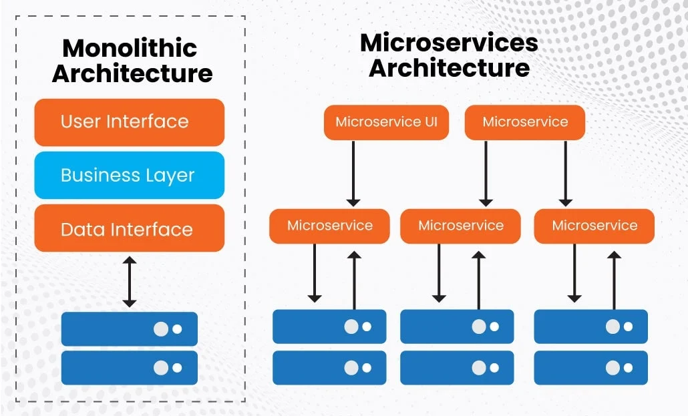

## Title: Getting Started with Python Microservices

# Introduction:
Python microservices offer a powerful and scalable approach to building modern software systems. By breaking down applications into smaller, independent components, developers can create flexible and maintainable systems that are easier to scale, deploy, and test. In this guide, we'll walk you through the essential steps to get started with Python microservices.

# Define the Service Boundaries:
The first step in building a Python microservice is to define its boundaries and scope. Identify the specific functionality or business capability that the microservice will provide. Keep the microservice focused on a single responsibility to ensure simplicity and maintainability.

# Choose a Microframework or Web Framework:
Python offers a range of microframeworks and web frameworks that provide the necessary tools and libraries to build microservices efficiently. Some popular choices include:

Flask: A lightweight and flexible microframework with a minimalistic approach that allows you to build RESTful APIs quickly.

FastAPI: A modern, high-performance web framework that leverages Python type hints to provide automatic API documentation and validation.

Django: A full-featured web framework that provides a comprehensive set of tools for building complex applications, including microservices.

Select a framework based on your project requirements, development style, and familiarity with the framework.

# Design the API:
Designing a well-defined API is crucial for effective communication between microservices. Determine the endpoints, request/response formats, and data models that your microservice will expose. Use standards like RESTful principles or GraphQL depending on your project needs. Tools like OpenAPI (formerly known as Swagger) can help with API documentation and validation.

# Implement the Service Logic:
The service logic is the heart of your microservice, where you implement the business functionality. Break down the logic into modular components, each responsible for a specific task. Leverage Python's extensive library ecosystem to handle database operations, caching, authentication, and other common functionalities.

# Manage Data Storage:
Microservices often require persistent data storage. Select a suitable database solution such as MySQL, PostgreSQL, MongoDB, or Redis, based on your specific needs. Use database libraries like SQLAlchemy or Django ORM for seamless integration with your Python microservice.

# Ensure Inter-Service Communication:
Microservices communicate with each other through APIs or messaging systems. Choose a communication method that aligns with your project requirements. RESTful APIs using HTTP/HTTPS are common for synchronous communication, while message brokers like RabbitMQ or Apache Kafka are suitable for asynchronous event-driven architectures.

# Containerize and Deploy the Microservice:
Containerization simplifies the deployment and management of microservices. Use tools like Docker to package your microservice along with its dependencies into a lightweight, portable container. Leverage container orchestration platforms like Kubernetes to automate deployment, scaling, and monitoring of your microservices.

# Implement Testing and Monitoring:
Ensure the reliability and stability of your microservice through thorough testing. Write unit tests to validate individual components and integration tests to verify interactions with other services. Implement logging and monitoring mechanisms to gain insights into the performance, availability, and health of your microservice.

# Conclusion:
Python microservices provide a flexible and scalable approach to building modern software systems. By following the steps outlined in this guide, you can start developing your own Python microservices. Remember to keep your microservices focused, define clear API boundaries, choose the right tools and frameworks, and prioritize testing and monitoring to ensure the quality and resilience of your microservicessss.
